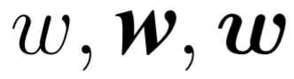
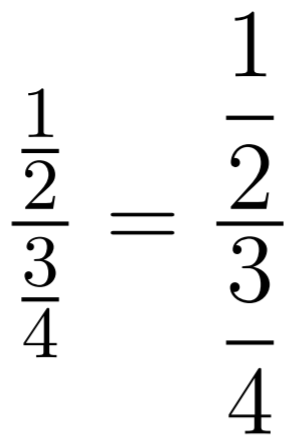
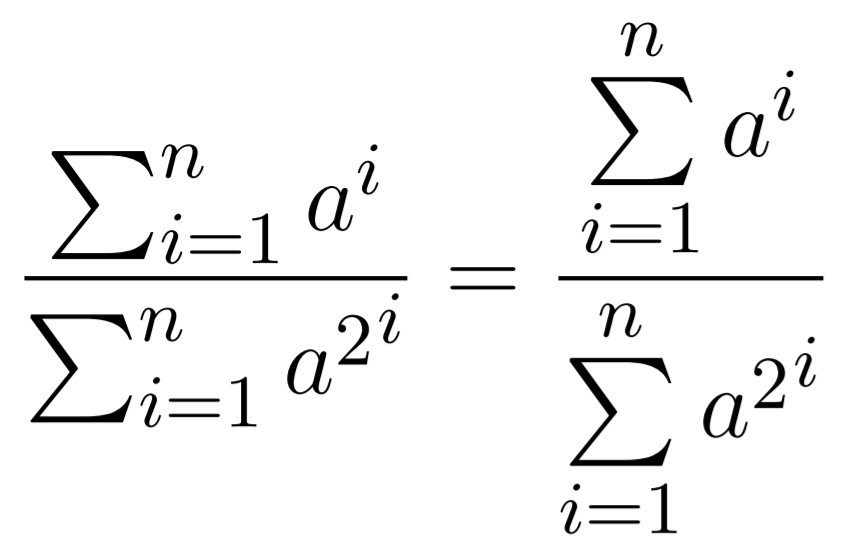

# APCS-thesis-template

This is our Overleaf thesis template for our university program APCS (VNU-HCM).

We are:
* Lê Phạm Ngọc Yến:
  * Student ID: 1751028
  * Email: lpnyen@apcs.vn
* Trần Thị Anh Thư:
  * Student ID: 1751036
  * Email: ttathu@apcs.vn

Our thesis topic: INTEGRATING NÔM LANGUAGE MODEL INTO NÔM OPTICAL CHARACTER RECOGNITION. (2021)

Both of us promise (to ourselves lol) that if our final score for our thesis exceed a threshold then we will make this template public.

This template does not contain everything that we use in our thesis as we only add more when we need it. <br>
However, in this README, we will try our best explain thing that we find useful during the writing process. <br>
Hopefully, you will find this template somewhat suitable to your need because we (well, only me, Ngọc Yến :>) spent more than a day to gather everything.

============================================================================ <br>
You will only need to download ``APCS-thesis-template.zip`` and ``thesis-cd-cover.drawio`` in ``download-this`` folder. <br>
``APCS-thesis-template.pdf`` is only a preview for you to know how the template will render.

```diff
**IMPORTANT: THIS TEMPLATE NEED TO BE RENDERED USING XeLaTeX.**
```
============================================================================ <br>

**SOME INSTRUCTIONS:**

- ``preliminaries`` folder is where we store front matter .tex file like **thesis proposal**, **acknowledgement**, etc.
- ``cover-templates`` folder is where we store cover templates like **main cover**, **title page**, etc. <br>
  However, we also put ``comments-of-thesis-advisor.tex`` and ``comments-of-thesis-reviewer.tex`` in there because we only need theses 2 files after thesis defense. But you can to move them to ``preliminaries`` folder if you want, just remember to change these 2 code lines:

  ```latex
  \input{cover-templates/comments-of-thesis-advisor}
  \input{cover-templates/comments-of-thesis-reviewer}
  ```

- ``figures``, ``fonts`` and ``ref`` are as name suggest.
- ``configurations.tex`` is the file that we put most of my packages and commands. We separate packages and commands according to (self-defined) categories like **pape setup*, **font setup**, etc. so that we can track thing easier but you can write them anywhere. What floats your boat.
- ``thesis.tex`` is the main .tex file.

- **TIP:** We give you the ``chapters`` folder to store individual chapter. However, we do recommend you dump everything in ``thesis.tex`` or writing all chapters in another .tex file then import in ``thesis.tex``. That way, the "File outline" panel to your left hand will render your entire thesis outline.

============================================================================ <br>

**SOME (USEFUL) TIPS:**

* **Some of my personal opinions regarding image that I think would make your paper look better:**

  1. One of our TA (teaching assistance) in a CS course gave both of us very harsh comments about our presentation (although we both have high demand in presentation, his is even higher, lol), and we really appriciate them. He said that you should have texts in your image written in the same font as your main text. So for us, when we write paper to submit to a conference, the font is usually Georgia, so have the text to be in Georgia. For this thesis, we have to write in Times New Roman, so have the text to be in TNR.

  2. When using images from other papers, if you can redraw them, REDRAW THEM (then cite them). You can use a free application called DrawIO (https://app.diagrams.net/) that in my opinion is very useful (although you need to work with it a little bit to get use to it). After finish drawing your image, you should export in either PNG (**CHANGE THE *Zoom* PARAMETER TO *300%***) or PDF. These 2 types can be imported into Overleaf.

     This application also allow you to write math (which will be rendered in amsfonts). To do this, you turn on: **Extras > Mathematical Typesetting** (you need to do this for pages that have math equations because it doesn't have universal effect). If you write short symbols then you only need to encapsulate it between `` ` ``; but if you want to write big equations then encapsulate it between ``$$``.
     
     You can also use different fonts other than the default fonts provided by the application. To import new font:
     
       1. Create a text box.
       2. Click on the text box, a panel on the righthand-side will appear, then choose the ``Text`` tab and you can see there is a font option.
       3. Click on the font option, choose ``custom``, choose ``Google Fonts``, then type the correct font name. For example, I want to use TNR so I type Times New Roman in the box. You can see the correct font's name in Microsoft Word.

* **Write Nôm script:**

  We almost given up on writing our thesis on Overleaf because we have to write in English, Quốc Ngữ script (current Vietnamese), Nôm script (old Vietnamese), and Han script (Chinese), but to cite, reference, write math equation, etc. using Microsoft Word is a total nightmare for us. So we tried our best to find a way to write Nôm Script on Overleaf and here's how:
  
  Overleaf support this way of rendering Unicode: ``\char"<unicode>`` (1); therefore, to write Nôm script, you need to find its unicode. But the code (1) is not enough, you need to encapsulate it in a font environment, hence, you will need to import font as follows:
  
  1. Put your true-type font into ``fonts`` folder.
  2. Using this command to import it:
  
     ```latex
     \newfontfamily{<font-cmd-name>}{<actual-font-name>}[Path = ./fonts/, Extension = .ttf]
     ```
  
  (I have import 2 fonts for this template so you can look at them and do as such.

  To write Nôm script, you will need 3 fonts: ``nomnatonglight.ttf``, ``HanaMinA.ttf``, and ``HanaMinB.ttf``. Most of the time we use *nomnatong*, but in some occasions we need *HanaMin*. Declare command for these fonts then encapsulate the code (1), e.g., we declare *nomnatong* as ``\nnt`` then write ``\nnt{\char"<unicode>}`` (2). If you find that writing this code line effect other text then put curly brackets around it, e.g. ``{\nnt{\char"<unicode>}}``. You can also declare a quick command for (2) like us: ``\newcommand{\uc}[1]{{\nnt{\char"#1}}}``. Then later you will only need to write ``\uc{<unicode>}``.
  
* **URL font:**

  We change the URL font to Times New Roman using this code line : ``\urlstyle{rm}``. So if you want to have URL font to be default (i.e., Consolas font) then you can remove it.
  
* **Center images that have width bigger than margin:** <br>
  Credit: https://tex.stackexchange.com/questions/16582/center-figure-that-is-wider-than-textwidth

  We use ``\centerfloat`` command a lot because the margin of the thesis template is quite large, leaving not so much space for the text. So we do occasionally have some tables or images that are large than ``\textwidth`` so we would use this command to center my tables and images.
  
* **Include images and table sideway:**

  If you want your image turn 90 degree while its caption still remain horizontal then you just need to use the ``angle`` parameter: <br>
  ``\includegraphics[..., angle=90]{<image-path>}``
  
  But if you want your caption to turn along with your image then encapsulate your image in ``sidewaysfigure`` environment like so
  
  ```latex
  \begin{sidewaysfigure}
      \centerfloat
      \includegraphics[...]{<image-path>}
      \caption{...}
      \label{fig:...}
  \end{sidewaysfigure}
  ```
  
  This is the same for table but table will be encapsulated in ``sidewaystable`` instead.
  
* **Include multiple subimages that span across multiple pages:**

  You can do this by using ``\ContinuedFloat`` command as follows:
  
  ```latex
  \begin{figure}
      ...
  \end{figure}
  \begin{figure}\ContinuedFloat
      ...
  \end{figure}
  ```
  
  **NOTE: If you search for this command then you will see that people say that you need ``subfig`` package but we actually don't import the package and can still use the command. One note that when we import ``subfig`` package, our code cannot render for some unknown reasons.**
  
* **Caption under an image or a table:**

  This is the code that I use to follow thesis template guideline so you don't have to modify anything else.
  
  ```latex
  \usepackage[labelsep=period, justification=centering, labelfont=bf, textfont=bf]{caption}
  ```
  
  **TIP:** If your caption happens to have citation, you should use this command:
  
  ```latex
  \caption[<caption-that-will-show-up-in-LOF-or-LOT>]{<caption-that-will-show-up-under-the-table-or-image>}
  ```
  
  So when you cite your image, you cite in the curly bracket section so that the citation won't show up in LOF (list of figure) or LOT (list of table). For example:
  ``\caption[Tesseract top-level.]{Tesseract top-level. \cite{raysmithorigin}}``.
  
* **Some useful parameters when include images:**

  1. ``trim = {<left> <lower> <right> <upper>}``: to trim border around image.
  2. ``height`` and ``width``: to adjust image size (else the imported image will have original size). <br>
     Remember to include ``\textheight`` or ``\textwidth`` after the number, e.g., ``width=2.6in\textwidth``.
  3. There is also a ``keepaspectratio`` parameter to use when you use both ``height`` and ``width``.

* **Some useful tips when writing tables:**

  1. ``thead`` command: this command is very useful if you want to write multiple lines in a table cell or you want a cell to have different alignment. For example:
  
     ```latex
     \begin{table}[!h]
         \centerfloat
         \begin{tabular}{|c|}
             \hline
             \thead[l]{Hello\\world} \\
             \hline
             Hello world \\
             \hline
         \end{tabular}
         \caption{...}
         \label{tab:...}
     \end{table}
     ```
     
     The 1st row will have the word *Hello world* written in 2 lines AND left align (by indicate in ``\thead[<align-mode>]{<text>}`` where ``<align-mode>`` is ``l`` for left). The 2nd row will have *Hello world* written on the same line and center aligned as indicate in ``\begin{tabular}{|c|}``.
     
  2. Have table borders be thicker. Import package ``tabu`` then replace ``\begin{tabular}`` and ``\end{tabular}`` with ``\begin{tabu}`` and ``\end{tabu}``.

     * For horizontal border to be thicker, call command ``\tabucline[<thickness>]{-}`` instead of ``\hline``.
     * For vertical border to be thicker, write like this example ``\begin{tabu}{|[<thickness>]c|c|l|[<thickness>]l|}``. The ``[<thickness>]`` will affect the ``|`` before it.

  3. Using this website https://tablesgenerator.com/ to write table faster.

* **Some useful parameters when writing lists:**

  1. You should include ``topsep`` parameter so that space between paragraphs is equal with space between a paragraph and a list, like this: ``\begin{itemize}[..., topsep=0pt]``.

  2. In this thesis, we have each paragraph indent on first line. So if you want your list (in particular the symbol) to flush with left margin then include ``leftmargin`` parameter like this: ``\begin{enumerate}[..., leftmargin=0.5cm]``.

  3. There is space between items (this space is bigger than the space between paragraphs), so:
     * If you want NO SPACE in between items then include ``noitemsep`` parameter like this: ``\begin{itemize}[..., noitemsep]``.
     * If you want space between items to be equal to space between paragraphs then include ``itemsep`` parameter like this ``\begin{itemize}[..., itemsep=0pt]``.

  4. If you want your ``enumerate`` list to be different, for example, ``Step 1.`` instead of ``1.`` then you can use ``label`` parameter like this: ``\begin{itemize}[label=Step \arabic*., ...]``.

* **Some useful tips when writing equations:**

  1. Encapsulate your equation in ``gather`` environment to have your equation asigned a number. However, we don't know why when using this, there are so much space before and after the equation; so to reduce you just use ``\vspace`` command.
  
     ```latex
     %% remember that this <space> need to be negative to reduce the space
     %% the ``*`` in the command just to make sure that if the equation on the first line of page
     %% then the space can still be reduced
     \vspace*{<space>}
     \begin{gather}
         <equation> %% no need to encapsulate equation in $$$$
     \end{gather}
     \vspace{<space>}
     ```
  2. If your equation is too long and you want to split it then just use ``split`` environment. For example:

     ```latex
     \begin{gather}
     \begin{split}
         \text{pLog}(c_{i, j}) = &\text{ }w_0 \\[-0.25cm]
         &+ w_1 \cdot \log{\left(P_{\text{OCR}}(c_{i,j})\right)} \\[-0.25cm]
         &+ w_2  \cdot \log{\left(P_{\text{MLM}}(c_{i,j} | \forall c \in \boldsymbol{s}_t \text{ and } c \neq c_{i,j})\right)}
     \end{split}
     \end{gather}
     ```
     
     The symbole ``&`` is an idicator of where to align, ``\\`` splits the equation, and ``[-0.25cm]`` is to reduce the line space in that particular equation line.
     
  3. In this thesis, we use ``amsmath``, ``amsfonts``, and ``amssymb`` package but the overall thesis will be written in Times New Roman. So when you use ``\text``, ``\textit`` or ``\textbf``  command in an equation, it will be rendered in TNR font. So if you want to bold your equation in ``amsfonts`` then you must use ``\boldsymbol`` command instead. For example:

     ```latex
     \begin{gather}
         w, \textbf{\textit{w}}, \boldsymbol{w}
     \end{gather}
     ```
     
     
 
  4. When writing fraction, you should use ``\dfrac`` instead of ``\frac``. For example:
 
     ```latex
     \begin{gather}
         \frac{\frac{1}{2}}{\frac{3}{4}} = \frac{\dfrac{1}{2}}{\dfrac{3}{4}}
     \end{gather}
     ```
     
     
     
  5. When writing ``\log``, ``\max``, ``\min``, ``\sum``, etc. you should add ``\limits`` behind them. For example:
 
     ```latex
     \begin{gather}
         \dfrac{\sum_{i=1}^n{a^i}}{\sum_{i=1}^n{{a^2}^i}} = \dfrac{\sum\limits_{i=1}^n{a^i}}{\sum\limits_{i=1}^n{{a^2}^i}}
     \end{gather}
     ```
     
     

**THE END.** <br>
*(I only remmeber this many so I will update if I remember something else)*
